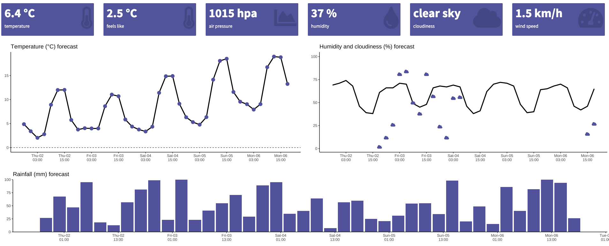

# A minimal shiny weather dashboard

### Demo can be found [here](https://reyfen.shinyapps.io/weather_demo/)

## Overview
This dashboard uses the [openweathermap](https://openweathermap.org/api) API to get current weather conditions as well as a 5 day forecast for a specific location. Data is fetched every 10 minutes which is recommended by the API documentation.

## API usage guide
https://openweathermap.org/appid#work

## Setup
- get and API key and provide it in the app (Line 42 in App.R)
- change the coordinates to your location (Line 62 and 73 in App.R)